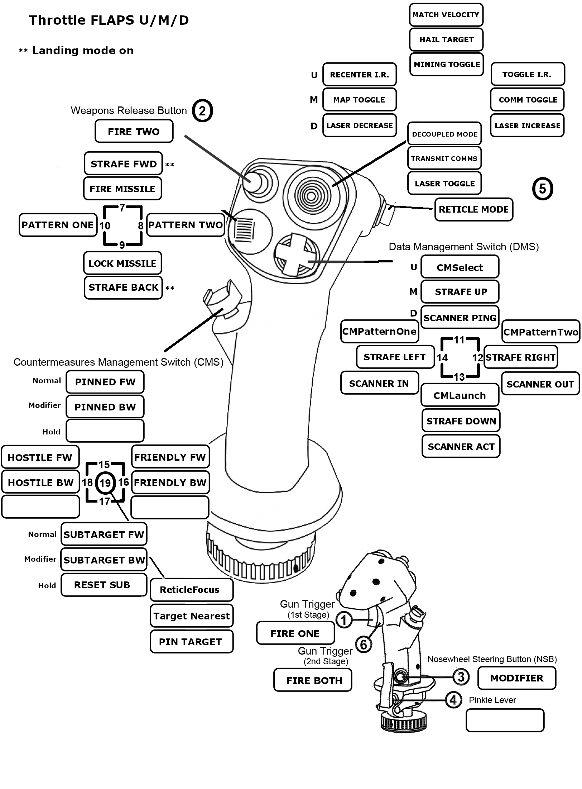
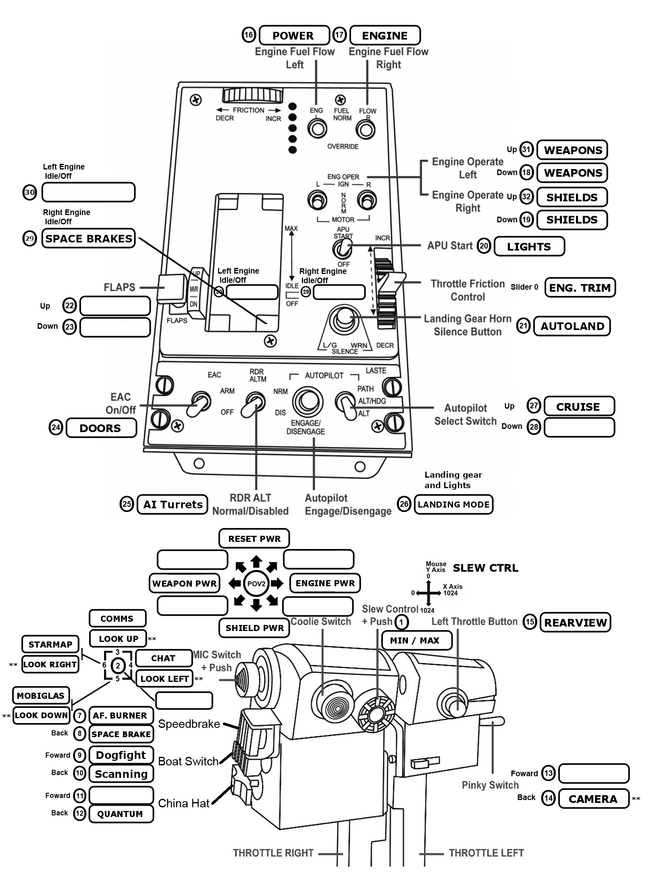

# StarCitizen-KillCrazy
#### Star citizen "Thustmaster Target" script for the HOTAS Warthog

This is a simple Target profile I made for the Thrustmaster Warthog to use in Star Citizen.
Most of the bindings are pretty simple, and consists of one to one mapping of the button
to the default bindings in Star Citizen.
I tried to keep as many default Star Citizen keybindings as possible so it's easier to
set back up.

I had intended to add the T.Flight Rudder Pedals to this profile, but for some reason they
refuse to work. You may have better luck, simple delete or comment out the line
```Configure(&TFRPRudder, MODE_EXCLUDED);``` in the StarCitizenXXX.tmc file to use them in the
profile. Mine seem to work for about 20 seconds then stop responding, so I just left them out
of the profile and load as a second controller in Star Citizen.

There are several special layers, and function to assist in getting all the commands I wanted.
They include the Joystick button S4, and the Throttle boat switch.
```SetShiftButton(&Joystick, S4, &Throttle, BSF, BSB, 0);``` Setup is shown below
   
### Modifier One: Joystick button S4

The Joystick button S4 acts as a IO shift modifier
Pressing S4 will alter the bindings of the Joystick HAT(4) which is used as targeting.
Pressing S4 adds ALT to any binding. Below is the bindings for HAT(4)
    
| CONTROL      | NORMAL BINDING         | MODIFIER BINDING           | BUTTON HELD             |
|--------------|------------------------|----------------------------|-------------------------|
| HAT(4) UP    | Cycle_Pinned_Toggle    | Cycle_Pinned_Toggle_Back   |                         |
| HAT(4) DOWN  | Target_Sub_System_Hold | Target_Sub_System_Back     | Target_Sub_System_Reset |
| HAT(4) RIGHT | Cycle_Friendly_Toggle  | Cycle_Friendly_Toggle_Back |                         |
| HAT(4) LEFT  | Cycle_Hostiles_Toggle  | Cycle_Hostiles_Toggle_Back |                         |
| HAT(4) PRESS | ReticleFocus_Hold      | Target_Nearest_Hostile     | Pin_Target_Focus        |


### Modifier Two: Joystick button S4
The Throttle boat switch acts as the ```U/M/D layer``` modifier.
This changes the bindings for ```HAT(1) and HAT(3)```
    
* Forward position: This is what I call the Dogfight or Defense mode.
* Center position: This is normal flying about minding my own business
* Back position: Scanning and Mining
    
| CONTROL      | BOAT FORWARD           | BOAT CENTER          | BOAT BACK             |
|--------------|------------------------|----------------------|-----------------------|
| HAT(1) UP    | Match_Target_Velocity  | HailTarget_Toggle    | MiningMode_Toggle     |
| HAT(1) DOWN  | Decoupled_Toggle       | TransmitComms_Toggle | MiningLaser_Toggle    |
| HAT(1) LEFT  | TrackIRPause_Toggle    | CommChannel_Toggle   | MiningIncrease_Toggle |
| HAT(1) RIGHT | TrackIRRecenter_Toggle | StarMap_Toggle       | MiningDecrease_Toggle |
|              |                        |                      |                       |
| HAT(3) UP    | CMSelect               | StrafeUp_Hold        | ScanningPing_Hold     |
| HAT(3) DOWN  | CMLaunch               | StrafeDown_Hold      | ScanningActivate_Hold |
| HAT(3) LEFT  | CMPatternTwo           | StrafeRight_Hold     | ScanningDecrease_Hold |
| HAT(3) RIGHT | CMPatternOne           | StrafeRight_Hold     | ScanningIncrease_Hold |


### Modifier Three: Throttle button
Pressing "Autopilot engage/disengage" button on the throttle will enter into "Landing Mode"
This will deploy the landing gear, turn on exterior ship lights, and rebinds joystick HAT(3)
for strafe forward and backward. This makes ```HAT(3) and HAT(2)``` able to strafe the ship all
six directions for easier landing and maneuvering.
Pressing the button again will retract the landing gear, turn off external ship lights, and
rebind ```Joystic HAT(3)``` back to default

NOTE: There is also a seperate switch ```APU Start switch``` that is used for External ship lights.
This switch and the Landing Mode button track the state of the lights. e.g if the lights were
switched on then Landing mode was used, it would not turn the lights off when gear was retracted.

### Modifier Four: Throttle pinkey switch
The Throttle pinky switch also acts as a modifier (Camera Mode) in that when switched to the back position
will enable camera view, and hold the freelook key.
In addition when in Camera Mode the Throttle MIC will is rebound as follows
    
| CONTROL   | CAMERA MODE OFF    | CAMERA MODE ON |
|-----------|--------------------|----------------|
| MIC UP    | CommChannel_Toggle | LookUp_Hold    |
| MIC DOWN  | MobiGlas_Toggle    | LookDown_Hold  |
| MIC LEFT  | StarMap_Toggle     | LookLeft_Hold  |
| MIC RIGHT | CommChat_Toggle    | LookRight_Hold |
    
With Camera mode on, and Landing mode on, I use the MIC switch to move the camera around and use the
Joystick HAT's to strafe the ship. landings becomes real easy this way.

Well, thats about it for the special binding stuff. Most of the rest of the bindings are pretty self
explanatory in the bindings file comments.

### Joystick and Throttle Mapping
Here is the Joystick and Throttle mappings for quick reference.

#### Joystick Mappings


#### Throttle Mappings


### Kill Crazy at RSI
https://robertsspaceindustries.com/orgs/KILLCAZY

I can't take full credit for this profile as I used a lot of code snippits from aboutFlash's profile
He has a pretty good Star Citizen profile and a lot of documentation, you can check out his code here
https://github.com/aboutflash/StarCitizen-WarthogScript

Hope you find it useful!
McCawley74
